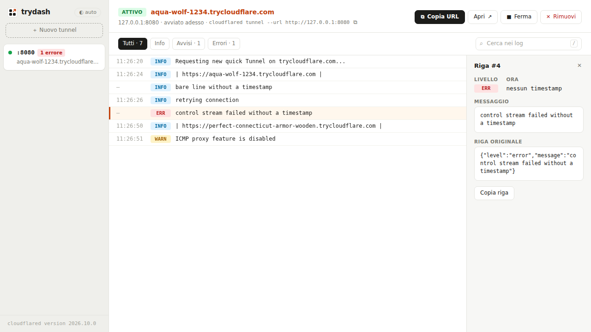

<p align="center">
  
</p>

<h1 align="center">trydash</h1>

<p align="center">
  Dashboard locale per i quick tunnel di <a href="https://developers.cloudflare.com/tunnel/get-started/quick-tunnels/">TryCloudflare</a>.<br>
  Esponi un servizio di sviluppo con un clic, tieni d’occhio tutti i tunnel e leggi i loro log in un posto solo.
</p>

<p align="center">
  <picture>
    <source media="(prefers-color-scheme: dark)" srcset="docs/images/screenshot-dark.png">
    
  </picture>
</p>

---

## Perché

`cloudflared tunnel --url http://localhost:3000` è comodissimo, ma con due o tre servizi aperti ti ritrovi con più terminali da tenere d’occhio, URL da ricopiare e log difficili da leggere. trydash avvia e gestisce i quick tunnel al posto tuo:

- **più tunnel insieme**, ciascuno con stato (in avvio, attivo, fermato, terminato), URL e numero di errori;
- **un clic** per creare, fermare, riavviare o rimuovere un tunnel. Per crearne uno basta scrivere la porta: `3000` diventa `http://127.0.0.1:3000`;
- **log leggibili**: livelli colorati, filtri, ricerca con evidenziazione, scorrimento continuo e modalità “segui la coda”;
- **i tunnel fermati restano consultabili**: puoi rileggerne i log e riavviarli. L’URL cambia a ogni avvio, ed è un limite dei quick tunnel;
- tema **chiaro e scuro**, layout per **mobile**, scorciatoie da tastiera.

## Funzioni

### Accesso via email

Apri **Accesso via email** nel modulo di creazione e scrivi gli indirizzi autorizzati: `mario@cliente.it` per una persona, `*@azienda.it` per tutto un dominio. Si separano con virgola, punto e virgola, spazio o a capo. Va bene anche un elenco incollato da Outlook con i nomi (`Mario Rossi <mario@cliente.it>; …`): trydash tiene solo gli indirizzi. Al massimo 20 voci.

trydash avvia il tunnel con `--allowed-mail` e lo segna con 🔒 nella sidebar. Chi apre l’URL deve prima fare l’accesso con uno degli indirizzi autorizzati.

Gli ultimi indirizzi usati compaiono come suggerimenti cliccabili (“recenti”). Restano solo nel tuo browser (`localStorage`), mai sul server.

### Traffico

trydash avvia ogni tunnel con `--metrics` e ogni 2 secondi legge le metriche di `cloudflared`:

- **nella sidebar**, una barra delle richieste in corso rispetto al limite di 200: arancione da 150, rossa a 200;
- **nell’intestazione del tunnel**, le richieste in corso, il totale delle richieste, gli errori, le connessioni verso Cloudflare e un piccolo grafico degli ultimi 5 minuti.

Se le metriche non rispondono, i numeri diventano grigi con “dati non aggiornati”. Quando il tunnel è fermo restano i totali finali.

### Opzioni dell’origine

Sotto **Opzioni origine**:

- **Host header**, cioè `--http-host-header`, per i server che rispondono solo a un nome host preciso;
- **Non verificare TLS**, cioè `--no-tls-verify`, per un’origine https con un certificato self-signed;
- **Origine HTTP/2**, cioè `--http2-origin`.

Email e opzioni restano uguali quando riavvii il tunnel. L’anteprima sotto il campo mostra il comando `cloudflared` equivalente. Si può copiare così com’è: le voci con `*` sono già tra apici.

### Prova con Hello World

Il pulsante avvia `cloudflared tunnel --hello-world`, che serve una pagina di prova. Ti fa verificare che `cloudflared` e la rete funzionino anche senza un server locale.

### Avvertenze

| Quando | Cosa vedi |
|---|---|
| l’origine non risponde (negli ultimi 60 s) | banner “Il tuo server su :3000 non risponde — è avviato?” con **Riavvia** e **Prova con Hello World** |
| 150 o più richieste in corso | banner sul limite di 200: le richieste in più ricevono `429` |
| `--no-tls-verify` attivo | etichetta “Certificato dell’origine non verificato” e ⚠ nella sidebar |
| tunnel protetto | etichetta con gli indirizzi autorizzati e 🔒 nella sidebar |
| Riavvia | il primo clic mostra “Nuovo URL — conferma”: un quick tunnel riavviato cambia URL |
| sempre, nel modulo | “Solo per prove · niente SSE · nessuna garanzia di uptime” |

### Lingua degli errori

I messaggi d’errore sono in italiano o in inglese, secondo la lingua del browser. Valgono anche per le risposte dell’API: il server legge l’header `Accept-Language`. Il resto dell’interfaccia è in italiano. I testi stanno in `public/js/i18n-it.js` e `public/js/i18n-en.js`.

## Installazione

Il modo più semplice è l’eseguibile già pronto: un unico file, senza Bun né altre dipendenze. Serve solo [`cloudflared`](https://developers.cloudflare.com/tunnel/downloads/) nel `PATH`. Se manca, la dashboard mostra i comandi per installarlo.

1. Dalla pagina **Releases** del repository scarica il file per il tuo sistema:

   | Sistema | File |
   |---|---|
   | Linux x64 | `trydash-<versione>-linux-x64` |
   | Linux ARM64 | `trydash-<versione>-linux-arm64` |
   | macOS Apple Silicon | `trydash-<versione>-darwin-arm64` |
   | macOS Intel | `trydash-<versione>-darwin-x64` |
   | Windows x64 | `trydash-<versione>-windows-x64.exe` |

2. Facoltativo: controlla il file con `SHA256SUMS`, pubblicato nella stessa release:

   ```sh
   sha256sum -c SHA256SUMS --ignore-missing
   ```

3. Avvialo:

   ```sh
   chmod +x trydash-1.0.0-linux-x64          # Linux e macOS
   xattr -d com.apple.quarantine trydash-1.0.0-darwin-arm64   # solo macOS, vedi sotto
   ./trydash-1.0.0-linux-x64
   ```

   Su Windows basta avviare il file `.exe`, da un terminale o con doppio clic.

`./trydash-… --version` stampa la versione. Le [variabili d’ambiente](#variabili-dambiente) sono le stesse dell’avvio da sorgente.

**macOS e Windows avvisano** perché i binari non sono firmati. Su macOS il comando `xattr` toglie il blocco di Gatekeeper sul file scaricato. Su Windows, se compare SmartScreen, scegli “Ulteriori informazioni” e poi “Esegui comunque”.

## Requisiti per lo sviluppo

- [Bun](https://bun.sh) ≥ 1.1
- [`cloudflared`](https://developers.cloudflare.com/tunnel/downloads/) nel `PATH`

Nessuna dipendenza npm.

## Avvio da sorgente

```sh
git clone https://github.com/mikzero/trydash.git
cd trydash
bun start            # oppure: bun server.js
```

Apri l’indirizzo stampato, di solito <http://127.0.0.1:8787>, scrivi la porta del tuo servizio e premi **Crea**.

### Variabili d’ambiente

| Variabile | Default | A cosa serve |
|---|---|---|
| `PORT` | `8787` | Porta della dashboard, che ascolta solo su `127.0.0.1`. |
| `DASHBOARD_SEED` | — | Con `1` carica una sessione d’esempio dai log in `test/fixtures/`. Utile per provare l’interfaccia senza aprire tunnel. |
| `DASHBOARD_PROBE` | `auto` | `present` o `missing` simulano la presenza o l’assenza di `cloudflared`, senza eseguirlo. |
| `DASHBOARD_PROBE_VERSION` | — | Testo della versione mostrato quando `DASHBOARD_PROBE=present`. |

Per provare la dashboard senza toccare la rete:

```sh
DASHBOARD_SEED=1 DASHBOARD_PROBE=present bun server.js
```

## Scorciatoie

| Tasto | Azione |
|---|---|
| `j` / `↓` | riga successiva |
| `k` / `↑` | riga precedente |
| `/` | cerca nei log |
| `Esc` | svuota la ricerca, chiude il dettaglio o il menu |

## Cose da sapere sui quick tunnel

I quick tunnel sono pensati per **test e sviluppo**. Dalla [documentazione Cloudflare](https://developers.cloudflare.com/tunnel/get-started/quick-tunnels/):

- l’URL `*.trycloudflare.com` è casuale e **cambia a ogni avvio**;
- al massimo **200 richieste contemporanee** per tunnel; oltre, la risposta è `429`;
- i **Server-Sent Events** non sono supportati;
- **nessuna garanzia di uptime**. Per la produzione serve un Cloudflare Tunnel con nome.

## Sicurezza

- La dashboard ascolta solo su `127.0.0.1`, quindi non è raggiungibile da altre macchine.
- Le altre pagine aperte nel browser non possono comandarla. Le richieste con un `Host` diverso da `127.0.0.1`/`localhost` vengono rifiutate, e questo blocca il DNS rebinding. Lo stesso vale per le richieste di modifica (`POST`, `DELETE`) con un `Origin` di un altro sito. Gli script locali senza `Origin`, come `curl`, continuano a funzionare.
- **Un tunnel rende pubblico il servizio che esponi**: chiunque abbia l’URL può raggiungerlo. Per limitarlo a persone precise usa l’accesso via email. Comunque non esporre servizi con dati reali o pannelli di amministrazione senza protezione.
- trydash non chiede né salva credenziali, token o account. I log restano in memoria e spariscono quando chiudi il server.
- Le origini con credenziali nell’URL (`http://user:pass@…`) vengono rifiutate.

## API

Il frontend usa una piccola API JSON, utile anche per script:

| Metodo | Percorso | Descrizione |
|---|---|---|
| `GET` | `/api/state` | stato di `cloudflared` e di tutte le sessioni |
| `GET` | `/api/probe?fresh=1` | ricontrolla `cloudflared` |
| `POST` | `/api/sessions` | crea un tunnel, body `{ "origin": "3000", "options": { … } }` (vedi sotto) |
| `POST` | `/api/sessions/:id/stop` | ferma il tunnel |
| `POST` | `/api/sessions/:id/restart` | riavvia un tunnel fermato o terminato |
| `DELETE` | `/api/sessions/:id` | ferma e rimuove la sessione |
| `GET` | `/api/sessions/:id/logs?offset=&limit=&levels=error,warn&q=testo` | pagina di log, filtrata (massimo 200 righe) |
| `GET` | `/api/sessions/:id/entries/:index` | una singola riga di log |

`options` è facoltativo:

```json
{
  "mode": "origin",
  "allowedMail": "mario@cliente.it, *@azienda.it",
  "hostHeader": "app.local",
  "noTlsVerify": false,
  "http2Origin": false
}
```

Con `"mode": "hello"` l’origine viene ignorata e il tunnel serve la pagina Hello World. Le risposte d’errore hanno la forma `{ "error": "…", "key": "options.mailInvalid", "params": { … } }`.

## Build locale

```sh
bun run build                                 # eseguibile per il sistema corrente, in dist/
bun run build -- --all --version 1.0.0        # tutti e 5 i sistemi
bun run build -- --target bun-linux-arm64     # un sistema preciso
```

La build genera `build/entry.js`, che incorpora tutti i file di `public/`, e lo compila con `bun build --compile`. In `dist/` finiscono gli eseguibili e `SHA256SUMS`. Ogni eseguibile pesa circa 85 MB, perché contiene il runtime di Bun. `build/` e `dist/` sono ignorate da git.

## Rilasciare una versione

Le release partono da un **tag git**. Il workflow `.github/workflows/release.yml` si attiva sui tag che iniziano con `v` ed esegue, nell’ordine:

1. i test (`bun test`);
2. la build dei 5 eseguibili, con la versione presa dal tag;
3. uno smoke test dell’eseguibile Linux: `--version`, avvio, risposta di `/` e `/api/state`;
4. la pubblicazione della Release su GitHub, con eseguibili, `SHA256SUMS` e il **messaggio del tag come note**.

Se un passo fallisce, la release non viene creata.

```sh
git checkout main && git pull
bun test                                          # verifica locale
bun scripts/release-notes.js v1.1.0               # bozza in release-notes.md
# rileggi e ritocca release-notes.md
git tag -a v1.1.0 -F release-notes.md --cleanup=verbatim
git push origin v1.1.0                            # avvia il workflow
```

Segui l’avanzamento in **Actions** su GitHub, oppure con `gh run watch`.

### Le note della release (messaggio del tag)

Il messaggio del tag annotato diventa il testo della Release. È Markdown e si scrive **in inglese**, come il sito principale:

```markdown
trydash 1.1.0                      ← prima riga: titolo della Release

One or two sentences on what this version brings.

## ⚠️ Breaking changes             ← solo se ce ne sono (versione MAGGIORE)
- …

## ✨ New
- **ui**: …

## 🐛 Fixes
- **server**: …

## 🔒 Security                      ← facoltativa
- …

## 🧰 Maintenance                   ← ci, docs, test, refactor
- …
```

GitHub aggiunge in fondo il link **Full Changelog** con il confronto rispetto alla versione precedente.

`scripts/release-notes.js` prepara la bozza dai commit successivi all’ultimo tag. Si basa su [Conventional Commits](https://www.conventionalcommits.org/it/), lo stile dei messaggi di commit del progetto:

| Commit | Sezione |
|---|---|
| `feat(ui): …` | New |
| `fix(server): …` | Fixes |
| `feat!: …` | Breaking changes |
| `ci:`, `docs:`, `test:`, `refactor:`, altri | Maintenance |

La bozza è un punto di partenza. Riscrivi le voci in inglese per chi usa trydash, non per chi legge il codice, e aggiungi la sezione Security quando serve.

Due avvertenze sul comando `git tag`:
- **`--cleanup=verbatim` è necessario.** Senza, git tratta le righe che iniziano con `#` come commenti e cancella i titoli Markdown.
- **Un tag senza messaggio** (`git tag v1.1.0`) pubblica comunque la Release, ma solo con le note automatiche di GitHub.

Per vedere il messaggio di un tag: `git tag -l --format='%(contents)' v1.0.0`.

### Come scegliere il numero di versione

I tag seguono il [versionamento semantico](https://semver.org/lang/it/), `vMAGGIORE.MINORE.PATCH`:

| Cambia | Quando | Esempio |
|---|---|---|
| **PATCH** | correzioni che non cambiano il comportamento previsto | `v1.0.0` → `v1.0.1` |
| **MINORE** | funzioni nuove compatibili con le precedenti | `v1.0.1` → `v1.1.0` |
| **MAGGIORE** | cambiamenti incompatibili (API, variabili d’ambiente, comportamento) | `v1.4.2` → `v2.0.0` |

- **Pre-release:** un tag con un trattino, come `v1.1.0-rc.1` o `v2.0.0-beta.2`, crea una release segnata come *pre-release*, che GitHub non mostra come “ultima versione”. Serve a provare una versione prima di pubblicarla davvero.
- **Tag annotati** (`git tag -a`): registrano autore, data e messaggio. Sono quelli giusti per le release.
- **Tagga solo `main`**, dopo che i test sono verdi.
- **Non spostare né riusare un tag già pubblicato.** Chi ha scaricato `v1.0.0` deve poter contare sul fatto che resti identica. Se una release ha un errore, pubblica la successiva (`v1.0.1`). Se il workflow è fallito prima di pubblicare, puoi cancellare il tag (`git push origin :refs/tags/v1.0.0` e `git tag -d v1.0.0`), correggere e ricrearlo.
- **Elenco delle versioni:** `git tag --sort=-v:refname`, oppure `gh release list`.

## Struttura

```
server.js            server HTTP e API (Bun, solo moduli node:*)
src/assets.js        lettura dei file del progetto (dal disco o incorporati nel binario)
src/runtime.js       avvio/arresto di cloudflared e lettura dello stream
src/traffic.js       lettura periodica delle metriche di cloudflared
src/load-dashboard.js carica le librerie condivise nel server
scripts/build.js     build degli eseguibili autonomi
scripts/release-notes.js bozza delle note di release dai commit
.github/workflows/   release automatica sui tag v*
public/js/           librerie condivise (parse, sessions, window, i18n…) e interfaccia
public/css/app.css   tema "Paper" chiaro/scuro
test/                test con bun test
docs/images/         screenshot del README
```

## Test

```sh
bun test
```

I test usano processi finti e non avviano mai `cloudflared`. Il test della build compila un eseguibile per il sistema corrente e lo avvia da un’altra cartella: ci vogliono un paio di secondi.

## Licenza

trydash è software libero, distribuito con licenza [GNU GPL v3.0 o successiva](LICENSE).

---

trydash è un progetto indipendente e non è affiliato a Cloudflare. “Cloudflare” e “TryCloudflare” sono marchi dei rispettivi proprietari.
